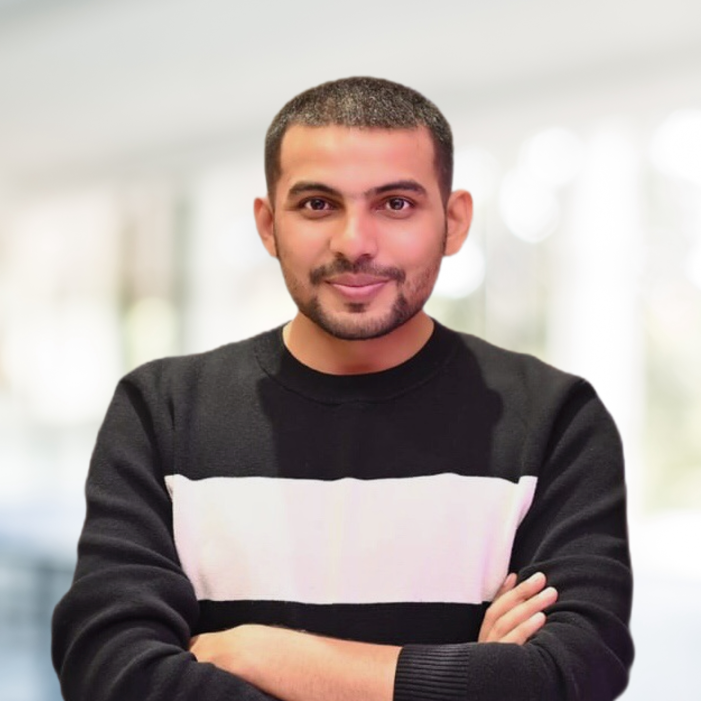

<table>
  <tr>
    <td width="250">
      
    </td>
    <td>
      <h1>Gaurav Pandey – Senior iOS Developer</h1>
      
Building production-ready iOS apps with focus on architecture, leadership, and real-world usability.

    </td>
  </tr>
</table>

---

## 👋 About Me

I’m **Gaurav Pandey**, a Senior iOS Developer with **10+ years of experience** delivering production-ready iOS applications.

- Specializing in **Swift**, **UIKit**, and modular architecture  
- Proven experience with **end-to-end app development**  
- Strong focus on **team leadership**, sprint planning, and mentoring  
- Committed to building apps that are scalable, maintainable, and user-friendly

---

## 🛠️ Skills & Professional Strengths  

- **Languages:** Swift, Objective-C  
- **UI Frameworks:** UIKit, SwiftUI (Learning Phase)  
- **Persistence:** CoreData  
- **Architecture Patterns:** MVC, MVVM, MVVM-C  
- **BLE Integration:** CoreBluetooth (Real project exposure, expanding skills)  
- **Tools & Automation:** Xcode, CocoaPods, SPM, SwiftLint, Fastlane  
- **CI/CD Workflows:** Fastlane setup for multi-environment deployment  
- **Team Collaboration:** Jira, Trello, Asana, Confluence  
- **Leadership Experience:** Code reviews, team mentoring, stakeholder communication  

---

## 💼 Professional Experience  

### Consultant Engineering – GlobalLogic  
**April 2023 – May 2024**  
- Led iOS development for **Kastle Presence** and **JBG Smith Office** apps.  
- Managed modular architecture, CI/CD setup, team leadership, and BLE workflows.  
- Awarded **"Spotlight of the Month"** for leadership and project delivery.

### Lead iOS Developer – UnravelApp  
**June 2021 – September 2022**  
- Developed **Unravel: Watch Plan Go** — featured on the App Store homepage.  
- Managed architecture modernization, CI/CD pipelines, and developer workflows.

### Tech Lead – Mobile, Docquity  
**November 2020 – January 2021**  
- Improved modular architecture through Swift Packages.  
- Mentored junior developers and contributed to team processes.

### Team Lead – Mobile & Project Manager, T9L  
**September 2013 – October 2020**  
- Delivered **15+ apps** end-to-end for multiple portfolio startups.  
- Managed full project lifecycle: product management, delivery, development.  
- Notable apps:  
  - **HalalTrip**  
  - **NirogStreet**  
  - **Crownit**  
  - **FarmerUncle**  
  - **Empwin**  
  - **ZiffyHomes**  
  - **Trailwalker (Oxfam)**  
  - **BitGiving**  
  - **Zilzar**  
  - **Khana**  
  - **SpellBee**

### Trainee Software Engineer – EsecForte Technologies  
**February 2013 – August 2013**  
- Worked on debugging, UI development, and API integration.

---

## 📲 Selected Apps on the App Store

Below are some key apps I've contributed to, focusing on end-to-end iOS development, modular architecture, and team leadership:

- [KastlePresence](https://apps.apple.com/in/app/kastlepresence/id1061078659) – Access control app for smart offices using BLE presence detection.
- [JBG Smith Office](https://apps.apple.com/in/app/jbg-smith-office/id6450704305) – Office access management application with BLE and credential features.
- [Unravel: Watch Plan Go](https://apps.apple.com/us/app/unravel-watch-plan-go/id1558162869) – Travel and shopping platform offering shopatainment experience.
- [Docquity](https://apps.apple.com/in/app/docquity/id1048947290) – Community networking app for healthcare professionals.
- [HalalTrip](https://itunes.apple.com/app/id680194589) – Travel and booking app tailored for halal-conscious travelers.
- [HealthTrip](https://apps.apple.com/in/app/health-trip/id1488887969) – Medical travel platform connecting patients with healthcare services.
- [NirogStreet](https://itunes.apple.com/us/app/nirogstreet/id1352321621?ls=1&mt=8) – Ayurveda-focused healthcare app for practitioners and patients.
- [Empwin](https://apps.apple.com/in/app/empwin/id1212850196) – Corporate engagement platform for employee activities and rewards.
- [Crownit](https://apps.apple.com/us/app/crown-it/id956797857) – Cashback and rewards app offering deals, surveys, and contests.

---

## 🌟 Beyond Code  

- **Gaming:**  
  _I enjoy games that require focus and adaptability such as_ **Far Cry 4** _and_ **Battlefield 4**.  
  _These help sharpen strategic thinking and problem-solving skills that reflect in my work._

- **Chess:**  
  _Regular player. Helps me stay focused and structured in problem-solving without chasing rankings._

- **Travel & Photography:**  
  _Exploring new places keeps me creatively refreshed._

---

## 📢 Contact  

- **LinkedIn:** [https://www.linkedin.com/in/gauravpandey](https://www.linkedin.com/in/gauravpandey)  
- **Email:** [gauravp02712@gmail.com](mailto:gauravp02712@gmail.com)  
- **Stack Overflow:** [https://stackoverflow.com/users/3647325/gaurav-pandey?tab=profile](https://stackoverflow.com/users/3647325/gaurav-pandey?tab=profile)

---

Thank you for visiting! Let’s connect and build something impactful together.

